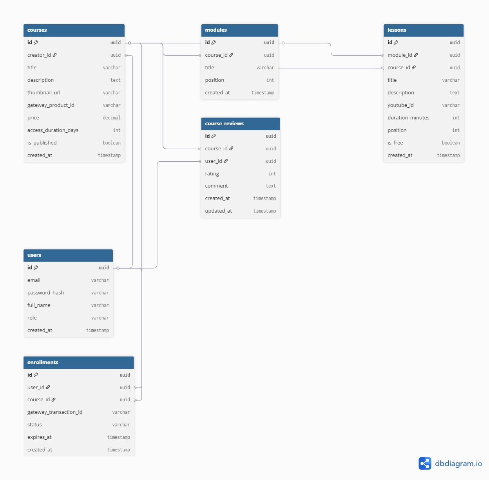

# Plataforma Web de Venda de Cursos

## Descrição
Aplicação web voltada para a venda de cursos online, contando com sistema de autenticação de usuários e fluxo completo de compra. A plataforma permite que os usuários naveguem pelo catálogo, adquiram acesso através de uma integração com API de pagamento e interajam com a comunidade por meio de comentários nas páginas dos cursos.

## GitHub Project
* https://github.com/users/Chicoz0/projects/3

## Tecnologias Utilizadas

| Camada | Tecnologia |
| :--- | :--- |
| **Frontend** | React + TypeScript |
| **Backend** | Go (Golang) |
| **Banco de Dados** | PostgreSQL |
| **Vídeos** | Links privados (ex: YouTube não listado) |
| **Pagamentos** | API externa ou Mock |

## Funcionalidades

### Usuários
* Cadastro de novas contas e autenticação (Login).
* Edição de informações do perfil.

### Catálogo de Cursos
* Listagem de cursos disponíveis.
* Página de detalhes com informações específicas de cada curso.

### Fluxo de Compra
* Carrinho/Fluxo de checkout.
* Integração com gateway de pagamento.
* Liberação automática de acesso ao conteúdo após a confirmação do pagamento.

### Interação
* Sistema de comentários em cursos (exclusivo para usuários autenticados).

### Área do Aluno
* Painel para visualização e acesso aos cursos adquiridos pelo usuário.

## Estrutura do Projeto

O repositório está organizado da seguinte forma:

* **/frontend**: Código-fonte da aplicação client-side em React.
* **/backend**: Código-fonte da API e lógica de servidor em Go.

## Estrutura do Banco de Dados

## Membros do Grupo

* Eduardo Vinicius Faleiro
* Francisco de Paula Lemos
* Lucas dos Santos Santin
* Lucas Gusmão Valduga
* Marlon Correia
